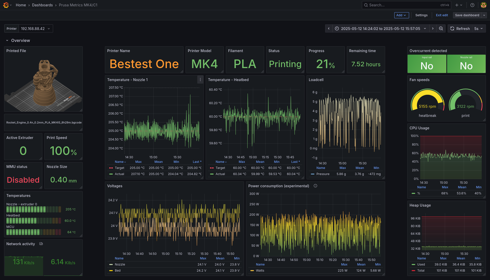

[](https://github.com/pstrobl96/prusa_exporter/actions/workflows/docker.yml) 
[](https://github.com/pstrobl96/prusa_exporter/actions/workflows/rpi.yml) 
 
 
 


# prusa_exporter

Prusa Exporter or more known as prusa_exporter is a tool that allows users to expose metrics from the Prusa Research 3D printers. Its approach is to scrape metrics from [Prusa Link](https://help.prusa3d.com/article/prusa-connect-and-prusalink-explained_302608) REST API and also from [line_protocol](https://github.com/prusa3d/Prusa-Firmware-Buddy/blob/master/doc/metrics.md) type of metrics. After gettng data it's simply exposes the metrics at `/metrics` endpoint.

**line_protocol** is configured in printer - Settings -> Network -> Metrics & Log

- Host => address where prusa_exporter is running aka your computer / server
- Metrics Port => default 8514 same as prusa_exporter but you can change it
- Enable Metrics => enable
- Metrics List => list of enabled metrics
  - You can select all but it has actual impact on performance so choose wisely

List of metrics needed for dashboard
- ttemp_noz
- temp_noz
- ttemp_bed
- temp_bed
- chamber_temp
- temp_mcu
- temp_hbr
- loadcell_value
- curr_inp
- volt_bed
- eth_out
- eth_in

Of course you can configure metrics with gcode as well - that gcode can be found [here](docs/examples/syslog/config_full.gcode) as well

```
M330 SYSLOG
M334 192.168.20.20 8514
M331 ttemp_noz
M331 temp_noz
M331 ttemp_bed
M331 temp_bed
M331 chamber_temp
M331 temp_mcu
M331 temp_hbr
M331 loadcell_value
M331 curr_inp
M331 volt_bed
M331 eth_out
M331 eth_in
```

**Prusa Link** is configured with [prusa.yml](docs/config/prusa.yml) where you need to fill - Settings -> Network -> PrusaLink

- `address` of the printer
- `username` => default `maker`
- `password` for Prusa Link
- `name` of the printer
  - your chosen name => just use basic name non standard - type
- `type` - model of the printer
  - MK3.9 / MK4 / MK4S / XL / Core One ...

### Dashboard

Pretty basic but nice and cozy [dashboard](docs/Prusa%20Metrics%20MK4_C1-1747124111854.json) for TV.



