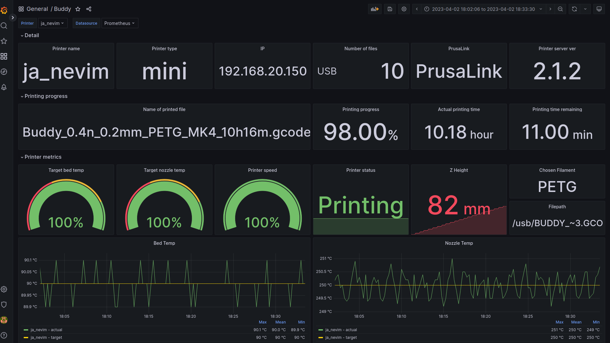
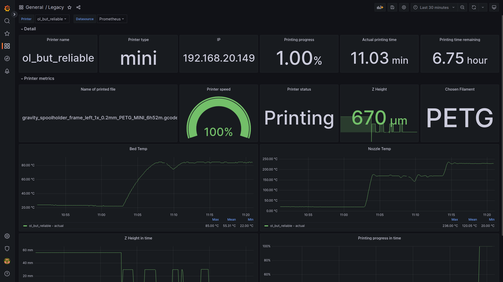

## Buddy Link Prometheus Exporter

This is implementation of Prometheus exporter for Prusas printers running Buddy board and Prusa Link Web - Like Prusa Mini or MK4 or XL. You can check any number of printers if you want to as long it has accesible Prusa Link API.

### buddy.yaml

Exporter loads buddy.yaml (file with connections to printers) from environment variable called **BUDDY_EXPORTER_CONFIG**. If you want to put this file in folder, where exporter is located then just set it to *buddy.yaml*.

### Grafana Dashboard

I also prepared one dashboard that you can find in grafana folder.

#### Buddy



#### Legacy



#### Format of buddy.yaml

In code block bellow you can see template for buddy.yaml config file. Type value is not that important, you can set anything you want. However this value would be written to labels in metrics, so be aware of that.

```
printers:
  buddy:
  - address: <address_of_printer>
    name: <your_printer_name>
    type: mini
    apikey: <your_printer_apikey>
  - address: <address_of_printer>
    username: maker # I'm not aware that there is posibility to change user name in XL or MK4 printers - default is maker
    pass: <password>
    name: <your_printer_name>
    type: <mini or xl>
  einsy:
  - address: <address_of_printer>
    apiKey: <your_printer_apikey>
    name: <your_printer_name>
    type: <mk2.5 or mk3>
  legacy:
  - address: <address_of_printer>
    name: <your_printer_name>
    type: mini

```

### Where to find exporter

Exporter runs at port 10009, selected specificaly, because all of the official ports from range 9000-9999 is occupied.

### How to install exporter

#### Docker

// TODO

#### Helm chart

// TODO
