[](https://github.com/pstrobl96/prusa_exporter/actions/workflows/docker.yml) 
[](https://github.com/pstrobl96/prusa_exporter/actions/workflows/rpi.yml) 
 
 
 


# Prusa Exporter - formerly Buddy Link Prometheus Exporter

This is an implementation of Prometheus Exporter for Prusa printers running Buddy boards (Prusa MK4, XL, and Mini) or Einsy boards (Prusa MK3(S(+)) with Prusa Link installed). Multi-target is supported out of the box so you can check any number of printers as long it has accessible Prusa Link API and you have enough computing power.

For MK3s with Einsy board you need to use at least version 0.7.0 of Prusa Link or higher, because there are many more metrics to scrape than in the older versions. You can find the most up to date version in the [Prusa Link repository](https://github.com/prusa3d/Prusa-Link/releases).

- [Prusa Exporter - formerly Buddy Link Prometheus Exporter](#prusa-exporter---formerly-buddy-link-prometheus-exporter)
  - [Where to find prusa exporter](#where-to-find-prusa-exporter)
  - [Roadmap](#roadmap)
  - [How to install prusa exporter](#how-to-install-prusa-exporter)
    - [Git Clone](#git-clone)
    - [Docker Compose](#docker-compose)
    - [Metrics](#metrics)
      - [Enable SYSLOG in printer](#enable-syslog-in-printer)
    - [Raspberry Pi](#raspberry-pi)
      - [Downloading image](#downloading-image)
      - [Raspberry Pi Imager](#raspberry-pi-imager)
        - [WiFi](#wifi)
        - [LAN](#lan)
      - [Flashing](#flashing)
      - [Config](#config)
    - [Config](#config-1)
      - [prusa.yml](#prusayml)
      - [agent.yml](#agentyml)
      - [prometheus.yml](#prometheusyml)
      - [promtail.yml](#promtailyml)
    - [Starting](#starting)
  - [Grafana Dashboards](#grafana-dashboards)
    - [Buddy](#buddy)
    - [Einsy](#einsy)
    - [Overview](#overview)

## Where to find prusa exporter

Prusa exporter runs on port 10009, but you can choose different port in `prusa.yml`. Metrics are accessible at `/metrics` endpoint.

## Roadmap

This list contains current and future features along with completion status:

- [x] Scrape of metrics from [Prusa Link](https://github.com/prusa3d/Prusa-Link/tree/0.7.0rc3)
- [x] Use of Grafana Cloud
- [x] CI pipeline with Docker Hub publish
- [x] Local instance of Grafana / Prometheus / Loki
- [x] Raspberry Pi Image
- [ ] Support for [connection](#21) to Einsy with username and password
- [x] Support for MK3 - it was implemented before but I want overhaul it and make it work
- [x] Dashboard update
- [ ] Send logs to Grafana Cloud
- [ ] Enable node_exporter for Grafana Cloud
- [ ] Optimize and get more syslog metrics
- [ ] Automatically send syslog config gcode to buddy boards 
- [ ] exporter toolkit implemenation
- [ ] Create endpoint for configuration update
- [ ] Unit tests
- [ ] Create systemd service for exporter and install script
- [ ] Properly provision on premise setup

## How to install prusa exporter

### Git Clone

First things first. You need to clone the repo and that which is very easy, right?

`git clone https://github.com/pstrobl96/prusa_exporter.git`

### Docker Compose

I've created docker-compose.yaml file, that can be used for deploy of exporter. You would need [Docker](https://docs.docker.com/engine/install/) and [docker-compose](https://docs.docker.com/compose/install/linux/) plugin installed. Right now it is possible to use `docker compose up` only with Linux because I do not build image for Linux.

### Metrics

Metrics that you can find in this exporter are "scraped" from two sources. First is Prusa Link, it is pretty usual REST API that returns all data in JSON. There is a lot of useful metrics but there are few that are missing. Like data from most of sensors and for example current or voltage. However this is not appliable to **Einsy printers like MK3, these supports only Prusa Link API.**

For Buddy - SYSLOG exists. [Syslog](https://en.wikipedia.org/wiki/Syslog) is standard for logging for a quite while however printer used it for sending metrics. Trough UDP. So what I just did is that I created experimental Syslog UDP server within this exporter and I'm catching these "metrics". **Be aware that these metrics can be send only via wired ethernet. You are out of luck over the air.**

**The issue is that if you have more printers you'll create a lot of traffic in the network.** Printer could send about 10-100 kB per second^needs more testing^. If you have more printers this number multiplies. I choose flag this feature experimental because you cannot be sure you'll get the metrics, it's UDP and printers are sending data as much as they can but it is not consistent. Between printers there are differences - obvisouly. 

Example how metrics looks can be found in  file. This file also includes Einsy and Buddy syslog metrics.

#### Enable SYSLOG in printer

Another issue with SYSLOG is configuration. You need munually enable sending metrics in printers GUI - step by step bellow. And you need to run specific gcode file, that specifies SYSLOG server. 

With M330 and M334 g-code you can configure your SYSLOG server and there are two ways how to get needed g-code. I've created  containing everything needed. **You just need to change IP address and you can change port. however while testing I had issues with numerous text editors and printer was very picky.** I was successful with `nano` and basic `echo` command in terminal. 

Second way is to add these two lines in to start of g-code with PrusaSlicer. Don't forget to change IP address and port! `10008` is default that I used but use whatever you want but you need also change that value in configuration.
```
M330 SYSLOG
M334 192.168.20.2 10008
```

For logs you use `M340` but it is not used in this exporter. Only if you are curious.
`M340 192.168.20.54 10008`

After loading gcode on to flash drive you can enable the metrics in printer.

Open `Settings`  
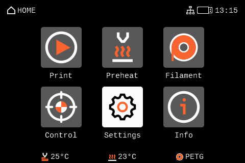

Navigate to `Network`  
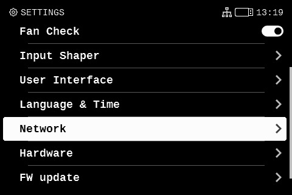

Find `Metrics & Log`  
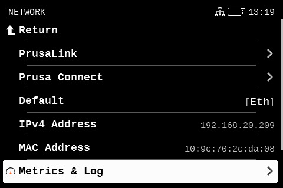

Now click on `Allow` - Confirm and change value to `Any Host`. Next switch on `Enabled Stored at Startup`  
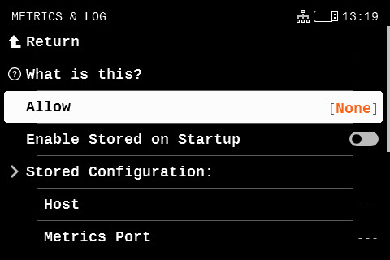
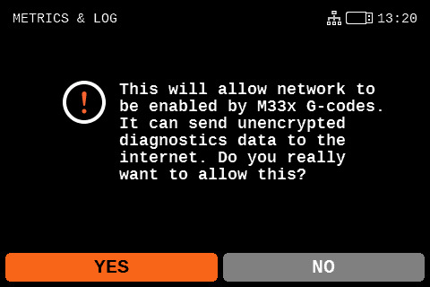
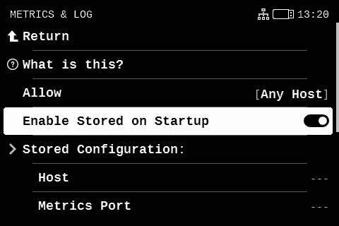

Now run your configuration gcode we created before
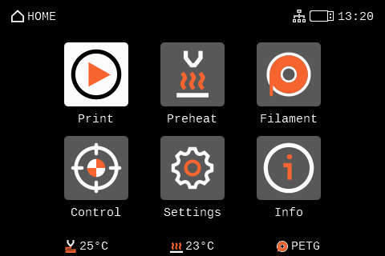
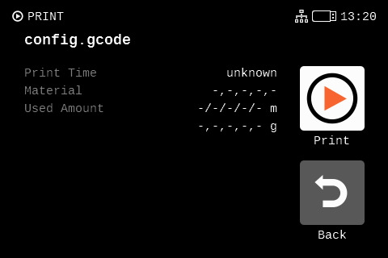

Navigate back to `Metrics & Log` and find `Current Configuration` - click on `Metrics Host` and store it as Host   


Click on `Metrics Port` and store it as Metrics Port  
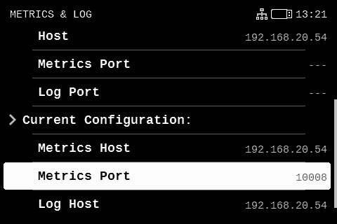
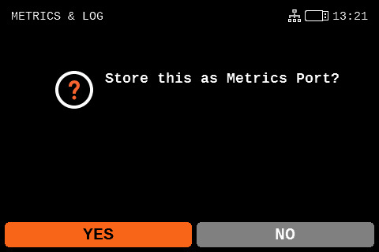

After configuration it should look like this. Only IP address should be different. And if different port was choosen then also port.  
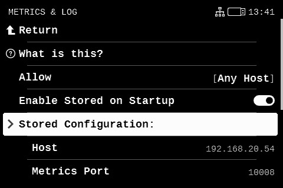


### Raspberry Pi

I also created Raspberry Pi image that can be flashed to memory card. If you choose this path you'll need following.

- Raspberry Pi (*4 and 5 tested*) with 64 bit support
- At least *Class 10* and at least *16 gigs* Memory card 

Of course all other accessories like computer, card reader, power supply etc. are mandatory. 

#### Downloading image 

Download image from [releases page](https://github.com/pstrobl96/prusa_exporter/releases) or alternatively you can choose CI pipeline run and download particular artifact. Downloaded *img.xz* file is named prusa_exporter_{version}.img.xz and needs to be flashed to the memory card.

#### Raspberry Pi Imager

[Download](https://www.raspberrypi.com/software/) and install Raspberry Pi Imager. You can alternatively use different tool but rpi-imager is easiest in terms of settings.  


After installing open the Raspberry Pi Imager. **Don't** click `Choose Device` instead of that click on `Choose OS`. Scroll down, you'll find `Use Custom`. Select downloaded image.  


Now connect memory card to your computer and click `Choose Storage`. **BEWARE** - you can mistakenly choose wrong storage media and flashing process includes formating your drive. Now select your Raspberry Pi memory card. Now click `Next`.


Now it depends if you want to connect via LAN or WiFi.

##### WiFi

If you want to use wireless ethernet, then click at `Edit Settings`. Click at `Configure wireless LAN` and write your WiFi name (SSID) and password. Don't forget to select correct Wireless LAN country. Next be sure that `Eject media when finished` is **unchecked** . Click `Save` and after that click on `Yes`. If you are sure that all content of your memory card would be erased, click `Yes`.


##### LAN

If you want to use wired ethernet, then click at `Edit Settings`, click `Options` and be sure that `Eject media when finished` is **unchecked** . Click `Save` and after that click on `Yes`. If you are sure that all content of your memory card would be erased, click `Yes`.


#### Flashing

Now wait for the Raspberry Pi Imager to complete the flash process.

#### Config

Now we need to configure *Grafana Agent* and *prusa_exporter*. After flashing you should see new partition connected to system, can be called `boot` or `bootfs`. In Windows you'll get also letter of partition, nowadays most probably `D:` - can varies. If you don't see new partition. Eject memory card from the system and reconnect it. 

In boot partition you'll find two files `agent.yaml` and `prusa.yml`. Configuration is mentioned in next part of README.

### Config

Please take a look at the [sample configuration examples](docs/examples/config) for prusa exporter, Prometheus, and Promtail. You will need to change few things to get it up and running. Of course you can change everything you want. If you are using Grafana Cloud, you can find your API key at [grafana.com](https://grafana.com/) -> My Account -> Grafana Cloud instance -> Send Metrics / Send Logs.

I also prepared a configuration for on-premise Prometheus and Loki if you do not want to use Cloud solution and you want to have your data somewhere local. You can find these [on-premise configs](docs/examples/config/on_premise) in the on_premise subfolder.  

#### prusa.yml

Prusa exporter loads [prusa.yml](docs/examples/config/prusa.yml) from an command flag `--config.file=<path>`. This flag can be empty and if so exporter will just try to load `prusa.yml` file located in the executable folder. Prusa exporter has implemented a config reloader that runs by default every 300 seconds (5 minutes).

You will find two sections in the config file, `exporter` and `printers`.

`exporter` is used for configuration of exporter itself:

```
exporter:
  metrics_port: 10009 # exporter port
  scrape_timeout: 1 # scrape timeout of Prusa Link
  reload_inteval: 300 # interval in seconds for config reloader
  log_level: info
```

`metrics_port`: you can set whatever you want. It is the port where Prometheus would scrape metrics endpoint. **Required**

`scrape_timeout`: Value in seconds that implies timeout of scraping Prusa Link devices. Not necessary needed for Einsy but needed for Buddy becuase printer sometimes do not return values. **Required**

`reload_inteval`: Because feature of config reloading is implemeneted, you need to specify interval of reloading. **Required**

`log_level`: log level of logger, default is info. **Optional**

`syslog_metrics`: **EXPERIMENTAL** allows export metrics from syslog. **Optional**

`syslog_port`: **EXPERIMENTAL** port where should syslog run. **Optional**

`printers` is used for configuring your target printers. Please note that `type` is informational and optional; if you define it it will be part of your metric labelset.

Note: Currently, you can not log into Einsy (Raspberry Pi Zero) boards with username and passwort. You need to generate an API key in Prusa Link settings. This will be resolved in a future release.

```
printers:
  buddy:
  - address: <address_of_printer>
    username: maker
    pass: <password>
    name: <your_printer_name>
    type: <mini/xl/mk4> **optional**
```

#### agent.yml

Grafana Agent is used in Raspberry Pi image and currently works only with Grafana Cloud - if you don't configure it different way. You need to change `url`, `username` and `password`. You can get these values in configuration of your Grafana Cloud. How you can find in [Grafana Cloud documentation](https://grafana.com/docs/grafana-cloud/send-data/metrics/metrics-prometheus/).

```
metrics:
  global:
    scrape_interval: 15s
    remote_write:
    - url: <YOUR CLOUD METRICS URL>
      basic_auth:https://grafana.com/grafana/dashboards/20393-buddy-detail/
        username: "<YOUR CLOUD METRICS USERNAME>"
        password: "<YOUR CLOUD METRICS PASSWORD>"
```

#### prometheus.yml

In [prometheus.yml](docs/examples/config/prometheus.yml) you need to change the `remote_write` section. This section is responsible for writing data to Grafana Cloud instance. You can get all values in config of your Grafana instance. You can get more information in [Grafana Docs](https://grafana.com/docs/grafana-cloud/data-configuration/metrics/metrics-prometheus/).

| key      | value                                  |
|----------|----------------------------------------|
| url      | this is where your instance is running |
| username | name that is used for login            |
| password | unique key used for login              |

```
remote_write:
- url: https://prometheus-prod-01-eu-west-0.grafana.net/api/prom/push
  basic_auth:
    username: userName
    password: apiKey
```

#### promtail.yml

In [promtail.yml](docs/examples/config/promtail.yml) you need to change the `clients` section. Thanks to this block promtail will send logs to your Grafana Cloud Loki instance instead of local Loki. More details of log ingestion in [Grafana docs](https://grafana.com/docs/grafana-cloud/data-configuration/logs/collect-logs-with-promtail/).

| key      | value                                                 |
|----------|-------------------------------------------------------|
| url      | this is string that you can generate in Grafana Cloud |

```
clients:
  - url: https://<User Name>:<Your Grafana.com API Key>@logs-prod-eu-west-0.grafana.net/loki/api/v1/push
```

### Starting

Starting of exporter is simple. Just change directory to where docker-compose.yaml and configs are and run following command.

```
docker compose up

```

:tada: if everthing went alright your instance is up and running and you can find metrics at [/metrics](http://localhost:10009/metrics) endpoint.

## Grafana Dashboards

I also prepared one dashboard per board which you can find in the [docs/examples/grafana](docs/examples/grafana) folder.

### Buddy

Download this dashboard straight from [Grafana.net](https://grafana.com/grafana/dashboards/20393-buddy-detail/)! Just use ID `20393` when importing.  


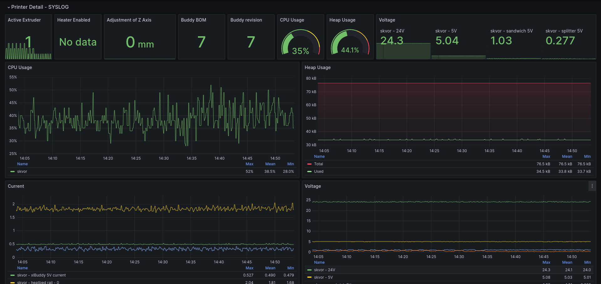

### Einsy

Download this dashboard straight from [Grafana.net](https://grafana.com/grafana/dashboards/20446)! Just use ID `20446` when importing.  


### Overview

This dashboard is used for monitoring all of your printers. Basically - green means printing, blue means ready, yellow means warning and red is error. You need [polystat panel](https://github.com/grafana/grafana-polystat-panel) for this dashboard.

Download this dashboard straight from [Grafana.net](https://grafana.com/grafana/dashboards/20449)! Just use ID `20449` when importing.  

